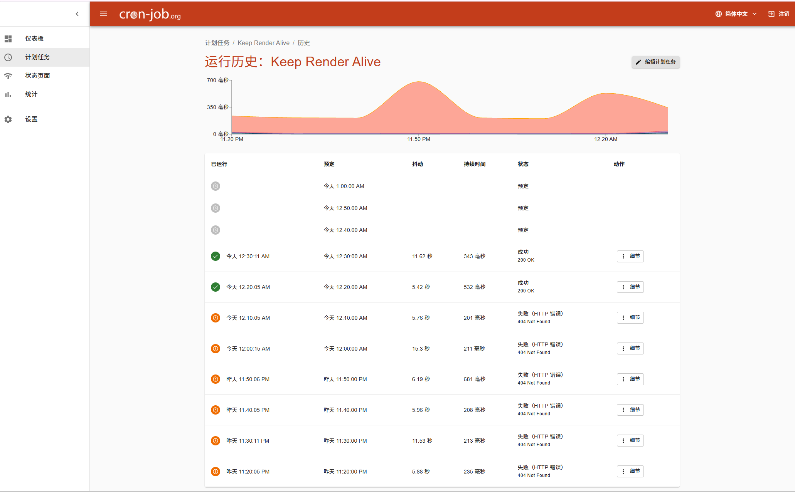

# 无痛学 - 沉浸式情景学习系统

一个基于AI的情景式学习平台，通过自然的人物对话帮助用户沉浸式学习知识。

## 在线体验

访问 [无痛学](https://wutongxue.8a5362ec.er.aliyun-esa.net) 开始你的学习之旅！

## 功能特点

### 核心功能
- **知识文件上传**: 支持 TXT、Markdown、PDF、Word、Excel 等多种格式
- **场景选择**: 职场办公、校园学习、实操场景三种模式
- **沉浸式对话**: AI生成自然的人物对话，融入知识要点
- **学习进度追踪**: 随时查看已学习的知识点摘要
- **知识点测验**: 通过互动测验巩固所学知识

### v1.7.0 重大更新 - 学习工具箱
- **学习数据统计仪表盘**: 可视化展示学习时长、学习次数、趋势图表
- **智能笔记系统**: 学习过程中随时记录笔记，支持导出 Markdown
- **知识点收藏夹**: 收藏重要知识点，分类管理，支持搜索
- **学习目标与打卡系统**: 设定每日/每周目标，连续打卡激励
- **错题本系统**: 自动收集测验错题，支持重做和标记掌握
- **学习成就系统**: 20+ 成就徽章，解锁成就激励学习
- **学习提醒通知**: 浏览器通知定时提醒学习
- **右侧工具栏**: 快速访问所有学习工具

### v1.6.2 新功能
- **环境音效**: 内置6种环境音效（雨声、森林、海浪、篝火、微风、咖啡馆）
- **番茄钟**: 专注计时器，25分钟专注 + 5分钟休息，提高学习效率
- **设置面板**: 字体大小调节、快捷键查看
- **自定义字体**: 支持小/中/大/特大四种字体大小

### v1.6.1 里程碑版本
- **云端数据库**: 迁移至 Turso 云端数据库，用户数据永久保存
- **数据持久化**: 修复服务重启后数据丢失的问题
- **性能优化**: 提升数据库访问速度和稳定性

### v1.6.0 功能
- **管理员后台**: 可视化查看用户数据和使用情况（快捷键 Ctrl+Shift+A）
- **旧版 Word 支持**: 支持 .doc 格式文件（Word 97-2003）
- **语音朗读**: 点击朗读按钮，AI 回复可语音播放
- **消息复制**: 一键复制对话内容
- **服务监控优化**: 后端健康检查接口，确保服务稳定

#### 健康检查生效验证

通过 cron-job.org 定时监控，后端健康检查接口已成功运行：



*之前返回 404 Not Found，添加健康检查路由后返回 200 OK*

### v1.5.0 功能
- **用户系统**: 注册登录后，学习记录自动同步到云端
- **多设备同步**: 在任意设备上继续你的学习
- **新用户引导**: 首次使用时的功能引导教程
- **历史记录恢复**: 点击历史记录即可恢复之前的对话

### 设计特点
- 温暖的米色/棕色系配色，避免蓝紫渐变
- 使用SVG图标替代emoji
- 有层次感的布局设计
- 细腻的交互动画和过渡效果
- 支持深色模式

## 项目结构

```
无痛学/
├── backend/           # 后端服务
│   ├── src/
│   │   ├── index.js   # 主服务文件
│   │   └── db.js      # Turso 数据库配置
│   ├── uploads/       # 上传文件临时存储
│   ├── package.json
│   └── .env.example   # 环境变量示例
├── frontend/          # 前端应用
│   ├── src/
│   │   ├── components/
│   │   │   ├── Header.jsx
│   │   │   ├── UploadSection.jsx
│   │   │   ├── ScenarioSelector.jsx
│   │   │   ├── ChatInterface.jsx
│   │   │   ├── AuthModal.jsx      # 登录注册弹窗
│   │   │   ├── UserTour.jsx       # 新用户引导
│   │   │   ├── HelpModal.jsx
│   │   │   └── ChangelogModal.jsx
│   │   ├── contexts/
│   │   │   └── AuthContext.jsx    # 用户认证上下文
│   │   ├── App.jsx
│   │   ├── main.jsx
│   │   └── index.css
│   ├── public/
│   ├── index.html
│   ├── package.json
│   ├── vite.config.js
│   └── tailwind.config.js
└── README.md
```

## 本地开发

### 前置要求

- Node.js 18+ (推荐 22.x)
- npm 或 yarn
- 通义千问 API Key ([获取地址](https://dashscope.console.aliyun.com/))

### 第一步：克隆项目

```bash
git clone https://github.com/1195214305/wutongxue.git
cd wutongxue
```

### 第二步：配置并启动后端

```bash
# 进入后端目录
cd backend

# 安装依赖
npm install

# 复制环境变量配置文件
cp .env.example .env

# 编辑 .env 文件，填入你的配置
# Windows 用户可以用记事本打开：notepad .env
# Mac/Linux 用户：nano .env 或 vim .env
```

**.env 文件内容：**
```
PORT=3001
DASHSCOPE_API_KEY=你的通义千问API密钥
JWT_SECRET=随便写一个复杂的字符串作为密钥
TURSO_DATABASE_URL=libsql://你的数据库.turso.io
TURSO_AUTH_TOKEN=你的Turso认证令牌
```

```bash
# 启动后端服务（开发模式，支持热重载）
npm run dev

# 或者生产模式启动
npm start
```

看到 `服务器运行在 http://localhost:3001` 表示后端启动成功。

### 第三步：配置并启动前端

**新开一个终端窗口**，保持后端运行：

```bash
# 进入前端目录（从项目根目录）
cd frontend

# 安装依赖
npm install

# 启动前端开发服务器
npm run dev
```

看到类似以下输出表示前端启动成功：
```
  VITE v5.x.x  ready in xxx ms

  ➜  Local:   http://localhost:3000/
  ➜  Network: http://192.168.x.x:3000/
```

### 第四步：访问应用

打开浏览器访问 http://localhost:3000 即可使用！

### 常见问题

**Q: 如何获取 Turso 数据库？**
A: 访问 [Turso](https://turso.tech/) 注册账号，创建数据库后获取连接地址和认证令牌。

**Q: 前端无法连接后端？**
A: 确保后端正在运行，且端口 3001 没有被占用。检查前端控制台是否有 CORS 错误。

**Q: 如何修改后端端口？**
A: 修改 `backend/.env` 中的 `PORT` 值，同时修改 `frontend/src/contexts/AuthContext.jsx` 和 `frontend/src/App.jsx` 中的 `API_BASE`。

## 生产部署

### 前端部署（阿里云 ESA Pages）

前端已部署在阿里云边缘安全加速 ESA 的 Pages 功能：

1. 连接 GitHub 仓库
2. 设置构建配置：
   - 安装命令：`npm install`
   - 构建命令：`npm run build`
   - 根目录：`/frontend`
   - 静态资源目录：`dist`
   - Node.js 版本：`22.x`
3. 添加环境变量：
   - `VITE_API_BASE`: 后端 API 地址（如果有部署后端的话）

### 后端部署

后端需要部署到支持 Node.js 的服务器，可选方案：

#### 方案一：阿里云函数计算 FC
适合轻量使用，按调用次数计费。

#### 方案二：阿里云 ECS 云服务器
完整的服务器环境，需要自己维护。

#### 方案三：其他云平台
- [Railway](https://railway.app/) - 有免费额度
- [Render](https://render.com/) - 有免费额度
- [Vercel](https://vercel.com/) - 支持 Serverless Functions

**注意**：如果不部署后端，用户系统（登录注册、云端同步）功能将不可用，但基本的学习功能仍可正常使用（数据存储在浏览器本地）。

## API 接口

### 服务状态
| 接口 | 方法 | 说明 |
|------|------|------|
| `/` | GET | 服务健康检查 |
| `/health` | GET | 健康检查（简洁版） |
| `/api/parse-doc` | POST | 解析 .doc 格式文件 |

### 用户认证
| 接口 | 方法 | 说明 |
|------|------|------|
| `/api/auth/register` | POST | 用户注册 |
| `/api/auth/login` | POST | 用户登录 |
| `/api/auth/me` | GET | 获取当前用户信息 |

### 学习功能
| 接口 | 方法 | 说明 |
|------|------|------|
| `/api/upload` | POST | 上传知识文件 |
| `/api/session/create` | POST | 创建学习会话 |
| `/api/start` | POST | 开始学习对话 |
| `/api/chat` | POST | 发送对话消息 |
| `/api/summary/:sessionId` | GET | 获取学习进度摘要 |

### 历史记录
| 接口 | 方法 | 说明 |
|------|------|------|
| `/api/history` | GET | 获取学习历史 |
| `/api/session/:sessionId` | GET | 获取会话详情 |
| `/api/history/:sessionId` | DELETE | 删除历史记录 |

## 技术栈

### 后端
- Node.js + Express
- 通义千问 API (Qwen Turbo/Max)
- Turso 云端数据库 (libSQL)
- JWT 认证
- bcryptjs 密码加密

### 前端
- React 18
- Vite
- Tailwind CSS
- Framer Motion (动画)

## 环境变量说明

### 后端 (.env)
| 变量名 | 必填 | 说明 |
|--------|------|------|
| `PORT` | 否 | 服务端口，默认 3001 |
| `DASHSCOPE_API_KEY` | 是 | 通义千问 API 密钥 |
| `JWT_SECRET` | 是 | JWT 签名密钥，建议使用随机字符串 |
| `TURSO_DATABASE_URL` | 是 | Turso 数据库连接地址 |
| `TURSO_AUTH_TOKEN` | 是 | Turso 认证令牌 |

### 前端 (.env)
| 变量名 | 必填 | 说明 |
|--------|------|------|
| `VITE_API_BASE` | 否 | 后端 API 地址，默认 http://localhost:3001 |

## 数据存储

- **Turso 云端数据库**：数据永久保存在云端
  - `users` 表：用户信息
  - `sessions` 表：学习会话
  - `messages` 表：对话消息
- **上传文件**：`backend/uploads/` 目录（临时存储）

## 贡献

欢迎提交 Issue 和 Pull Request！

## 许可证

MIT License
